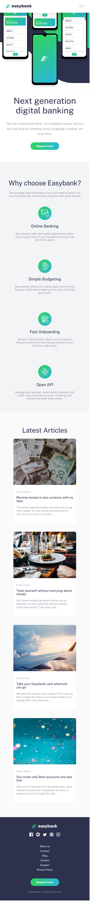

# Frontend Mentor - Easybank landing page solution

This is a solution to the [Easybank landing page challenge on Frontend Mentor](https://www.frontendmentor.io/challenges/easybank-landing-page-WaUhkoDN). 

### The challenge

Users should be able to:

- View the optimal layout for the site depending on their device's screen size
- See hover states for all interactive elements on the page

### Screenshot

 

### Links

- Solution URL: [Github](https://github.com/kanuos/Easybank-landing-page)
- Live Site URL: [GH Pages](https://your-live-site-url.com)

### Built with

- Semantic HTML5 markup
- CSS custom properties
- Flexbox
- CSS Grid
- Mobile-first workflow
- Vanilla JavaScript

## Author

- Website - [Sounak](https://www.sounakmukherjee.com)
- Frontend Mentor - [@kanuos](https://www.frontendmentor.io/profile/kanuos)
- Github - [@kanuos](https://www.github.com/kanuos)

